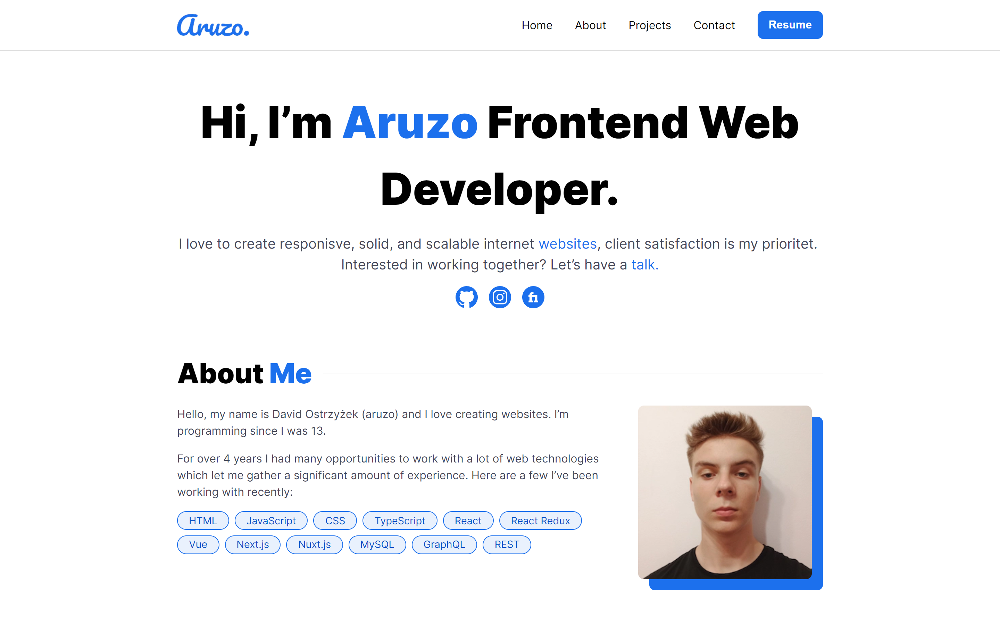

# Portfolio

### Personal portfolio site created to show who I am and what I create.

### https://aruzo.it



## Build With

- React
- Next
- Tailwind

## Installation and Usage

### Clone this repository

```bash
git clone https://github.com/aruzo1/portfolio.git
cd portfolio
```

### Install Dependencies

```bash
npm install
```

### Run Application

```bash
npm start
```

Runs the app in the development mode.\
Open [http://localhost:3000](http://localhost:3000) to view it in the browser.

The page will reload if you make edits.\
You will also see any lint errors in the console.
